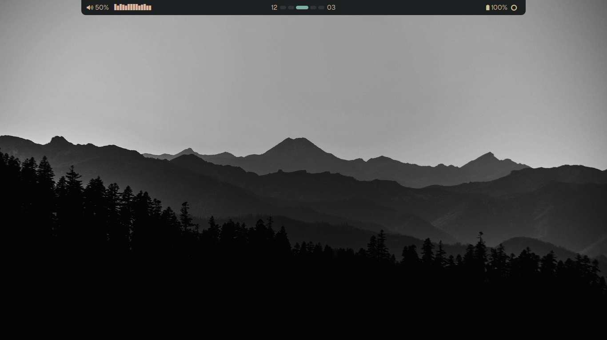
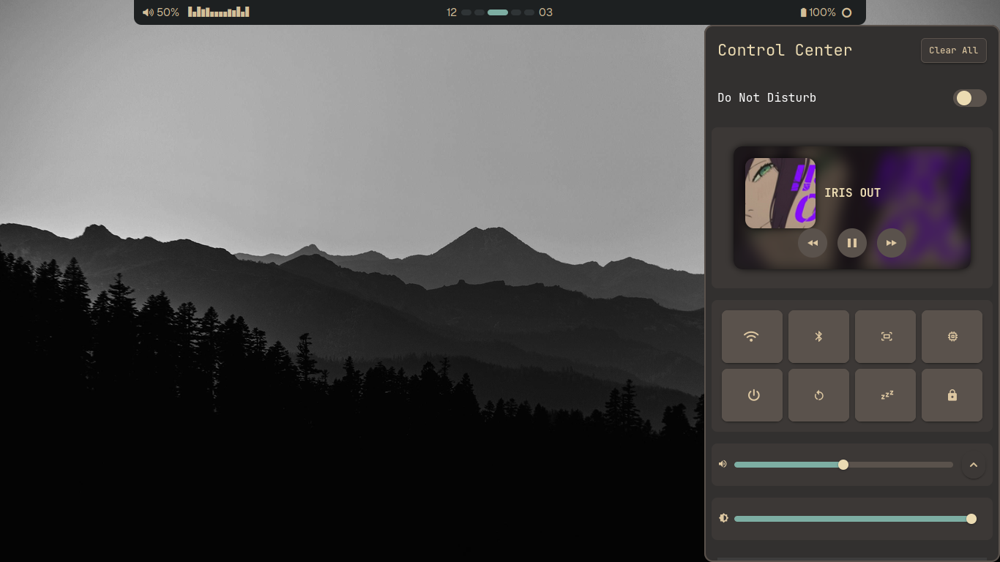
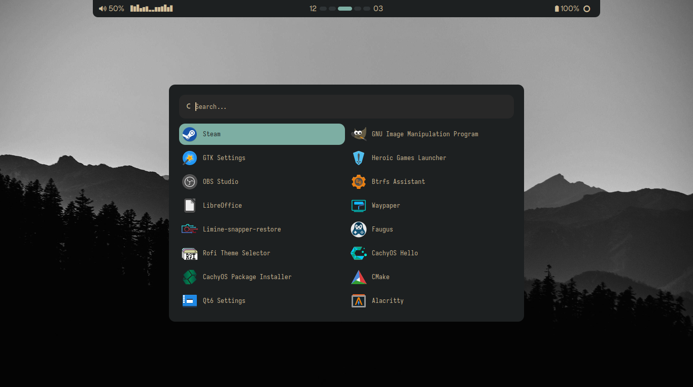

# my hyprland Dotfiles

My personal Hyprland setup on CachyOS. 

## Screenshots







## What's Inside

| Config | Purpose |
|--------|---------|
| `hypr` | Hyprland window manager |
| `waybar` | Status bar |
| `swaync` | Notification daemon |
| `rofi` | Application launcher |
| `kitty` | Terminal emulator |
| `fish` | Shell |
| `starship` | Shell prompt |
| `cava` | Audio visualizer |
| `wifi-manager` | Wi-Fi management (TUI/GUI) |
| `GTK-3.0` | GTK config |
| `GTK-4.0` | GTK config |
| `Gruvbox-Material-Dark` | GTK theme |

## Keybindings

`mainMod` = `SUPER`. Full list in `hypr/binds.lua`.

| Key | Action | Key | Action |
|-----|--------|-----|--------|
| `SUPER + Return` | Terminal | `SUPER + Q` | Close window |
| `SUPER + E` | File manager | `SUPER + F` | Fullscreen |
| `SUPER + Space` | Launcher | `SUPER + G` | Float |
| `SUPER + B` | Browser | `SUPER + M` | Maximize |
| `SUPER + T` | Editor | `SUPER + L` | Lock screen |
| `SUPER + 1–9` | Workspace 1–9 | `SUPER + W` | Wallpaper |
| `SUPER + SHIFT + 1–9` | Move to workspace | `SUPER + V` | Clipboard |
| `SUPER + ←/→/↑/↓` | Focus window | `SUPER + P` | Color picker |
| `SUPER + H/L/K/J` | Focus (Vim) | `SUPER + R` | Reload waybar |
| `SUPER + ALT + ←/→` | Resize H | `Print` / `SUPER + S` | Screenshot |
| `CTRL + ALT + ←/→/↑/↓` | Move window | `SUPER + Tab` | Next workspace |

> **Note:** This configuration uses Hyprland's Lua syntax (0.55+). Keybinds are
> defined with `hl.bind()` in `hypr/binds.lua`. If you're on an older Hyprland
> version using `hyprlang`, you'll need to convert these to `bind = MOD, KEY, ...`
> format.

## Requirements

- Hyprland
- Waybar
- SwayNC
- Rofi
- Kitty
- VS codium
- Fish shell
- Starship
- Cava
- thunar
- awww
- waypaper
- wifi manager
- helium
- paru
- vim

Install on Arch/CachyOS:

## Installation

clone this repository and run the installation script.

```bash
git clone https://github.com/Ario0o/dot-files ~/dot-files
cd ~/dot-files
./install.sh
```

If you prefer to only install the configuration files without installing any dependencies, run:

```bash
./install.sh --no-deps
```
if you like to use symlink instead, run:

```bash
./install.sh --symlink
```

> **Note:** you can run ./install.sh --symlinks --no-deps to install the config files 
> without installing any dependencies

The script will:
- Detect your distribution (auto-install supported for Arch/CachyOS).
- The script install configs into `~/.config/` and themes into `~/.themes/`,
backing up anything it overwrites to `~/.dotfiles-backup-<timestamp>`.

## update config

if you want to update your config to a newer verion, run:

```bash
./update_config.sh
```
if you installed the symlink version, run:

```bash
./update_config.sh --symlink
```

## install dependencys sepearatly 

```bash
sudo pacman -S --needed --noconfirm \
    hyprland swaync \
    rofi-wayland fuzzel \
    kitty fish starship \
    awww pamixer alacratty\
    thunar thunar-volman gvfs gthumb \
    network-manager-applet brightnessctl playerctl \
    grim slurp wl-clipboard cliphist \
    pipewire pipewire-pulse wireplumber pavucontrol \
    bluez bluez-utils blueman \
    polkit-kde-agent xdg-desktop-portal-hyprland \
    qt5-wayland qt6-wayland \
    ttf-jetbrains-mono-nerd noto-fonts noto-fonts-emoji \
    vscodium paru vim
```

```bash
paru -S --needed \
    vscodium-bin \
    helium-browser-bin \
    waybar-cava-git \
    otf-geist-mono-nerd \
    waypaper
```
## Credits 
Originally based on
[babyanonymouse/Zero_Drag.dotfiles](https://github.com/babyanonymouse/Zero_Drag.dotfiles).

Gruvbox material themes from
[TheGreatMcPain/gruvbox-material-gtk](https://github.com/TheGreatMcPain/gruvbox-material-gtk).
